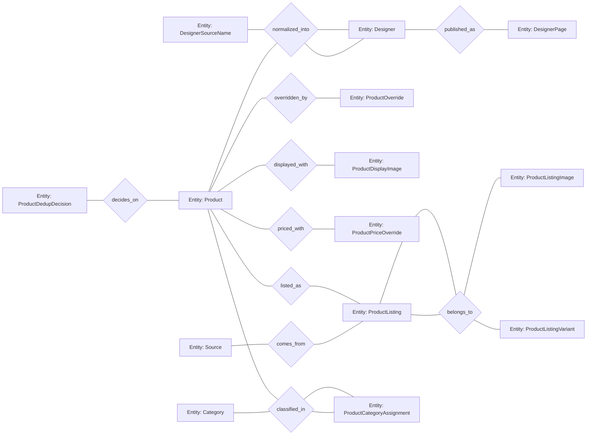
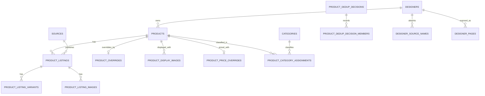

# 02. Conceptual Chen Model

> [!info]
> Это концептуальная модель.
> Она описывает **смысловые сущности** и их отношения, без SQL-деталей.

## 1. Главная идея

Новый товарный контур должен строиться вокруг двух разных сущностей:

- `Product` — канонический товар каталога;
- `ProductListing` — товар конкретного источника.

Текущая ошибка старой схемы заключалась в том, что эти две сущности были насильно слиты в одну.

## 2. Концептуальные сущности

### 2.1. Product

Это сущность каталога, которой управляет бизнес и админка.

У нее есть:

- канонический дизайнер;
- канонический пол;
- коммерческий режим продажи;
- канонический вес;
- статус жизненного цикла;
- статус видимости;

Но у нее **нет**:

- собственного базового source-like title/description дубля;
- source URL как доменного ядра;
- source handle;
- source variant identity;
- source image list как единственного источника правды.

### 2.2. ProductListing

Это карточка товара в конкретном источнике.

Она хранит:

- source;
- url;
- handle;
- external_id;
- базовые title/description товара;
- исходные source-тексты;
- ingest-status;
- source-specific orderability snapshot;
- время первого и последнего обнаружения.

> [!note]
> Для `sync`-listing это тексты, пришедшие из магазина.
> Для `manual`-listing это тексты, введенные админом как базовое содержимое товара.

### 2.3. ProductListingVariant

Это вариант внутри source listing.

Хранит:

- порядок;
- source ref;
- sku;
- title;
- price;
- currency;
- availability.

### 2.4. ProductListingImage

Это изображение, приехавшее из источника.

### 2.5. ProductOverride

Это ручные правки админа для каталога:

- title override;
- description override;
- description visibility;
- force visible.

Это именно editorial-слой поверх канонического товара.
Он не подменяет саму сущность `Product`, а лишь позволяет витрине и admin UI жить с ручной надстройкой поверх базовых полей primary listing, которую можно отдельно сбросить.

### 2.6. ProductDisplayImage

Это конечный порядок изображений, который увидит витрина:

- source image;
- uploaded image asset;
- hidden flag;
- explicit order.

### 2.7. ProductPriceOverride

Это отдельная сущность ручной рублевой цены товара:

- ручная цена в рублях;
- ручная старая цена в рублях для эффекта скидки.

Она не подменяет source price и не является частью editorial override.

### 2.8. Designer / DesignerSourceName / DesignerPage

Нужны для разделения:

- исходного бренда;
- канонического дизайнера;
- страницы дизайнера в каталоге.

### 2.9. CatalogFilter / CatalogFilterNode

Нужны для дерева фильтров и мультифильтров.

### 2.10. Category / ProductCategoryAssignment

Нужны для локальной товарной классификации, которую админ видит в карточке товара и использует как сырье для части rule-based логики.

### 2.11. CustomCatalog

Нужен для ручных витринных списков товаров.

### 2.12. ProductDedupDecision

Нужна для явного журнала решений merge/combine/reject/undo.

### 2.13. ShowcaseCategory

Нужна для фиксированных верхних категорий витрины:

- Новинки
- Дизайнеры
- Мужское
- Женское
- Скидки

## 3. Chen-style conceptual diagram

> [!note]
> Mermaid в Obsidian не поддерживает полноценную нотацию Чена с атрибутами-овалами и ромбами как отдельный тип диаграммы.
> Поэтому ниже используется Chen-style представление через `flowchart`, а ниже в документе — строгая ER/UML аппроксимация.

## 4. Physical ER approximation

## 5. Самые важные смысловые разделения

### Product != ProductListing

Если их не разделить, снова возникают:

- `dedup://...`;
- конфликт ручного и source товара;
- путаница между базовым listing title и editorial override;
- невозможность нормально поддерживать multi-source future.

### Commercial availability != Source orderability

Если их не разделить, снова смешаются две разные вещи:

- что уже физически есть у продавца на руках (`В наличии`);
- что пока можно только заказать из источника (`Под заказ`);
- и что в самом source сейчас вообще можно или нельзя выкупить.

### Manual ruble price != Source price != Derived price

Если их не разделить, снова смешаются:

- price у source variant;
- итоговая derived рублевая цена после формулы;
- ручная рублевая цена админа;
- старая рублевая цена для эффекта скидки.

### Designer != Source Brand

Если их не разделить, невозможно качественно реализовать:

- слияние брендов в одну страницу дизайнера;
- исключение бренда из директории;
- единое описание страницы дизайнера.

### Filter != ShowcaseCategory

Если их не разделить, UI верхней навигации опять начнет диктовать структуру данных напрямую.

### Category != Filter

Если их не разделить, локальная классификация товара снова смешается с витринной навигацией и rule-based фильтрами.

### ListingVariant != ProductVariant

На текущем admin-продукте нужен именно source-level вариант.
Канонический variant entity пока не обязателен.
Поэтому в новой модели нужен `ProductListingVariant`, а не искусственный “глобальный вариант товара”.
