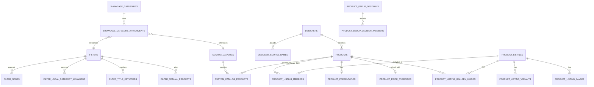

# 03. Logical Schema

> [!info]
> Ниже уже не просто концепция, а целевая логическая структура таблиц.
> Это write-model новой БД.

## 1. Catalog core

### `products`

Канонический товар каталога.

Это не source snapshot и не presentation-layer.
Эта таблица хранит базовую бизнес-сущность товара, вокруг которой уже живут listing, presentation, изображения и таксономия.

| Column | Type | Null | Meaning |
|---|---|---:|---|
| `id` | bigint | no | PK |
| `designer_id` | bigint | yes | Финальный публичный дизайнер |
| `primary_listing_id` | bigint | yes | FK -> `product_listings.id`, какой member-listing дает товару базовые title/description |
| `gender` | text enum | no | `male / female / unisex` |
| `availability_mode` | text enum | no | `in_stock / by_order` |
| `manual_weight_grams` | integer | yes | Ручной вес, если админ задал его явно |
| `weight_rule_id` | bigint | yes | FK -> `weight_rules.id` |
| `lifecycle_status` | text enum | no | `active / merged` |
| `visibility_status` | text enum | no | `visible / hidden` |
| `created_at` | timestamptz | no | Создан |
| `updated_at` | timestamptz | no | Обновлен |

### `product_listings`

Атомарная карточка товара конкретного источника.

| Column | Type | Null | Meaning |
|---|---|---:|---|
| `id` | bigint | no | PK |
| `source_id` | bigint | no | FK -> `sources.id` |
| `external_id` | text | yes | Внешний product id source |
| `url` | text | no | Нормализованный source URL |
| `handle` | text | yes | Source handle |
| `source_title` | text | no | Базовое название listing |
| `source_description_html` | text | yes | HTML-описание |
| `source_description_text` | text | yes | Plain-text описание |
| `source_weight_grams` | integer | yes | Вес, если его реально отдал источник |
| `source_designer_raw` | text | yes | Сырой бренд источника |
| `source_category_raw` | text | yes | Сырая category источника |
| `orderability_status` | text enum | no | `orderable / sold_out / unavailable` |
| `status_reason` | text | yes | Причина недоступности |
| `ingest_mode` | text enum | no | `sync / manual` |
| `last_seen_at` | timestamptz | no | Последний импорт |
| `last_synced_at` | timestamptz | yes | Последний update listing |
| `created_at` | timestamptz | no | Создан |
| `updated_at` | timestamptz | no | Обновлен |

> [!important]
> В новой модели базовый snapshot title/description живет в `product_listings`.
> `sync`-listing хранит тексты источника.
> `manual`-listing хранит базовые тексты, введенные админом.
> Ручные text/html правки поверх этого snapshot живут в `product_presentation`.
> Отдельного канонического дубля title/description в `products` больше нет.

> [!important]
> `product_listings` не принадлежат `products` напрямую через FK.
> Их включение в витринный товар описывается отдельной таблицей `product_listing_members`.

> [!important]
> `orderability_status` не равен витринному `В наличии / Под заказ`.
> `orderability_status` отвечает только на вопрос, можно ли сейчас купить товар у исходного продавца.

> [!important]
> В новой модели итоговый вес не хранится в `products` отдельным полем.
> Правильная модель:
> - `products.manual_weight_grams` хранит ручной вес;
> - `product_listings.source_weight_grams` хранит source-вес, если источник его реально прислал.
> - `products.weight_rule_id` фиксирует правило веса только когда у primary listing нет source-веса, а rule сработало.
> - итоговый вес собирается как derived-значение при чтении.

### `product_listing_members`

Состав витринного товара из атомарных source-листингов.

| Column | Type | Null | Meaning |
|---|---|---:|---|
| `product_id` | bigint | no | FK -> `products.id` |
| `listing_id` | bigint | no | FK -> `product_listings.id` |

> [!important]
> Для активного витринного товара `products.primary_listing_id` обязан ссылаться на один из его member-listing.
> При merge новый товар получает плоский union member-listing входных товаров без вложенных цепочек вида `AB + C`.
> Один `listing_id` может принадлежать только одному текущему `product_id`.
> При merge member-строки перепривязываются к новому товару, а входные товары остаются только как `lifecycle_status = merged`.

### `product_listing_variants`

| Column | Type | Null | Meaning |
|---|---|---:|---|
| `id` | bigint | no | PK |
| `listing_id` | bigint | no | FK -> `product_listings.id` |
| `position` | integer | no | Стабильный порядок |
| `source_ref_id` | text | yes | Внешний id варианта |
| `sku` | text | yes | SKU варианта |
| `title` | text | no | Название варианта |
| `price_amount` | numeric | yes | Цена |
| `compare_at_price_amount` | numeric | yes | Исходная цена до скидки |
| `currency_code` | char(3) | yes | Валюта |
| `is_orderable` | boolean | no | Можно ли сейчас заказать вариант у источника |
| `created_at` | timestamptz | no | Создан |
| `updated_at` | timestamptz | no | Обновлен |

### `product_listing_images`

| Column | Type | Null | Meaning |
|---|---|---:|---|
| `id` | bigint | no | PK |
| `listing_id` | bigint | no | FK -> `product_listings.id` |
| `position` | integer | no | Порядок от source |
| `url` | text | no | Source image URL |
| `created_at` | timestamptz | no | Создан |

### `product_presentation`

Слой представления товара поверх `products`, который можно отдельно менять без переписывания базового канонического товара.

| Column | Type | Null | Meaning |
|---|---|---:|---|
| `product_id` | bigint | no | PK/FK -> `products.id` |
| `title_override` | text | yes | Ручное название |
| `description_text` | text | yes | Ручное текстовое описание |
| `description_html` | text | yes | Ручное HTML-описание |
| `description_visibility` | boolean | yes | Показывать ли описание |
| `created_at` | timestamptz | no | Создан |
| `updated_at` | timestamptz | no | Обновлен |

> [!important]
> `title_override`, `description_text` и `description_html` не являются “второй копией канонических полей”.
> Это единственный ручной слой поверх базовых полей primary listing.

> [!important]
> `description_text` и `description_html` живут независимо.
> Админ может сначала изменить текстовую версию, а потом отдельно HTML-версию.
> Обе должны сохраняться одновременно.

### `product_price_overrides`

Отдельная 1:1 сущность ручной рублевой цены товара.

| Column | Type | Null | Meaning |
|---|---|---:|---|
| `product_id` | bigint | no | PK/FK -> `products.id` |
| `manual_price_rub` | numeric | no | Ручная итоговая цена в рублях |
| `manual_compare_at_price_rub` | numeric | yes | Старая цена в рублях для эффекта скидки |
| `created_at` | timestamptz | no | Создан |
| `updated_at` | timestamptz | no | Обновлен |

> [!important]
> Наличие строки в `product_price_overrides` означает, что для товара отключен derived pricing из source + формулы.
> Синхронизация товара как сущности не выключается, выключается только автоматическое вычисление итоговой витринной цены.

> [!important]
> `manual_compare_at_price_rub` не является второй “текущей” ценой.
> Это только зачеркнутая старая рублевая цена для витринного эффекта скидки.

### `product_listing_gallery_images`

| Column | Type | Null | Meaning |
|---|---|---:|---|
| `id` | bigint | no | PK |
| `product_id` | bigint | no | FK -> `products.id` |
| `listing_id` | bigint | no | FK -> `product_listings.id` |
| `listing_image_id` | bigint | yes | FK -> `product_listing_images.id` |
| `image_asset_id` | bigint | yes | FK -> `image_assets.id` |
| `position` | integer | no | Порядок внутри фото-стека выбранного listing |
| `is_hidden` | boolean | no | Скрыто ли изображение |
| `origin_kind` | text enum | no | `source_image / uploaded_asset` |
| `created_at` | timestamptz | no | Создан |
| `updated_at` | timestamptz | no | Обновлен |

> [!important]
> Если `listing_image_id` заполнен, он обязан ссылаться на изображение того же `listing_id`.
> Также `listing_id` обязан входить в состав `product_id` через `product_listing_members`.

> [!important]
> Эта модель специально различает два типа картинок в стеке конкретного member-listing:
> - source images из `product_listing_images` нельзя физически удалять из source-layer, потому что sync потом снова их найдет;
> - их можно только скрывать на уровне `product_listing_gallery_images.is_hidden`;
> - вручную загруженные картинки с `origin_kind = uploaded_asset` можно удалять из display-стека.

> [!warning]
> В старой схеме поля вида `*_asset_ids` по имени обещали хранить IDs, но фактически местами содержали URL-строки.
> В новой схеме это запрещено.
> Если колонка называется `*_id`, она хранит только FK-значение.

## 2. Designers

### `designers`

| Column | Type | Null | Meaning |
|---|---|---:|---|
| `id` | bigint | no | PK |
| `name` | text | no | Финальное имя дизайнера в каталоге |
| `slug` | text | no | URL дизайнера |
| `description` | text | yes | Общее описание дизайнера |
| `is_enabled` | boolean | no | Дизайнер активен в каталоге |
| `created_at` | timestamptz | no | Создан |
| `updated_at` | timestamptz | no | Обновлен |

### `designer_source_names`

| Column | Type | Null | Meaning |
|---|---|---:|---|
| `id` | bigint | no | PK |
| `designer_id` | bigint | yes | FK -> `designers.id` |
| `source_name` | text | no | Исходный бренд источника |
| `created_at` | timestamptz | no | Создан |
| `updated_at` | timestamptz | no | Обновлен |

## 3. Taxonomy and showcase

### `filters`

Это справочник фильтров как бизнес-сущностей.

| Column | Type | Null | Meaning |
|---|---|---:|---|
| `id` | bigint | no | PK |
| `title` | text | no | Основное имя фильтра |
| `display_title` | text | yes | Optional override для витринного блока `Раздел` |
| `slug` | text | no | Автогенерируемый технический slug |
| `node_kind` | text enum | no | `filter / multifilter` |
| `is_enabled` | boolean | no | Активность |
| `restrict_by_gender` | boolean | no | Применять ли к leaf-фильтру gender-scope из `men/women` витрины |
| `created_at` | timestamptz | no | Создан |
| `updated_at` | timestamptz | no | Обновлен |

> `slug` не вводится админом вручную.
> Он автоматически строится из `title` через transliteration + slugify и пересобирается при изменении `title`.
> `display_title` опционален.
> Если он пустой, в витринном блоке `Раздел` используется обычный `title`.
> `node_kind` можно менять, но только если после изменения дерево остается валидным.
> Узел `filter` не может иметь детей.

### `filter_nodes`

Отдельная таблица дерева.

| Column | Type | Null | Meaning |
|---|---|---:|---|
| `id` | bigint | no | PK |
| `filter_id` | bigint | no | FK -> `filters.id` |
| `parent_node_id` | bigint | yes | FK -> `filter_nodes.id` |
| `position` | integer | no | Порядок внутри parent |

> При смене `filters.node_kind` система должна проверять дерево до сохранения.
> Нельзя сохранять структуру, где узел с `node_kind = filter` остается родителем других узлов.

### `filter_local_category_keywords`

| Column | Type | Null | Meaning |
|---|---|---:|---|
| `id` | bigint | no | PK |
| `filter_id` | bigint | no | FK -> `filters.id` |
| `keyword` | text | no | Ключевое слово local-category label |

> Эти ключевые слова матчатся не с отдельной admin-managed таблицей категорий,
> а с already normalized local-category labels у товара.

### `filter_title_keywords`

| Column | Type | Null | Meaning |
|---|---|---:|---|
| `id` | bigint | no | PK |
| `filter_id` | bigint | no | FK -> `filters.id` |
| `keyword` | text | no | Ключевое слово title |

### `filter_manual_products`

| Column | Type | Null | Meaning |
|---|---|---:|---|
| `filter_id` | bigint | no | FK -> `filters.id` |
| `product_id` | bigint | no | FK -> `products.id` |

### `custom_catalogs`

| Column | Type | Null | Meaning |
|---|---|---:|---|
| `id` | bigint | no | PK |
| `title` | text | no | Основное имя каталога |
| `description` | text | yes | Описание каталога для витрины |
| `slug` | text | no | Автогенерируемый технический slug |
| `is_enabled` | boolean | no | Виден ли каталог |
| `created_at` | timestamptz | no | Создан |
| `updated_at` | timestamptz | no | Обновлен |

> `slug` не вводится админом вручную.
> Он автоматически строится из `title` через transliteration + slugify и пересобирается при изменении `title`.

### `custom_catalog_products`

| Column | Type | Null | Meaning |
|---|---|---:|---|
| `catalog_id` | bigint | no | FK -> `custom_catalogs.id` |
| `product_id` | bigint | no | FK -> `products.id` |

### `showcase_categories`

Фиксированные верхние сущности витрины.

| Column | Type | Null | Meaning |
|---|---|---:|---|
| `id` | bigint | no | PK |
| `code` | text | no | `new / designers / men / women / sale` |
| `title` | text | no | Видимое имя |

> `showcase_categories` создаются только seed/migration-слоем.
> В админке у них нет CRUD.
> По `code` backend валидирует особые ограничения каждой категории.

### `showcase_category_attachments`

| Column | Type | Null | Meaning |
|---|---|---:|---|
| `id` | bigint | no | PK |
| `showcase_category_id` | bigint | no | FK -> `showcase_categories.id` |
| `attachment_kind` | text enum | no | `filter / custom_catalog` |
| `filter_id` | bigint | yes | FK -> `filters.id` |
| `custom_catalog_id` | bigint | yes | FK -> `custom_catalogs.id` |
| `position` | integer | no | Порядок |

### `showcase_category_attachment_hidden_nodes`

| Column | Type | Null | Meaning |
|---|---|---:|---|
| `attachment_id` | bigint | no | FK -> `showcase_category_attachments.id` |
| `filter_node_id` | bigint | no | FK -> `filter_nodes.id` |

> [!important]
> `filter_node_id` обязан принадлежать тому же фильтру, который используется текущим `attachment_id`.
> Нельзя скрывать узел чужого фильтра через attachment другой сущности.

## 4. Dedup decisions

### `product_dedup_decisions`

Журнал решений админа по дублям.

| Column | Type | Null | Meaning |
|---|---|---:|---|
| `id` | bigint | no | PK |
| `decision_kind` | text enum | no | `reject / merge` |
| `created_product_id` | bigint | yes | FK -> `products.id`, новый активный товар, созданный результатом merge |
| `created_at` | timestamptz | no | Создан |

### `product_dedup_decision_members`

Входные товары конкретного решения.

| Column | Type | Null | Meaning |
|---|---|---:|---|
| `decision_id` | bigint | no | FK -> `product_dedup_decisions.id` |
| `product_id` | bigint | no | FK -> `products.id` |

## 5. Logical schema diagram

