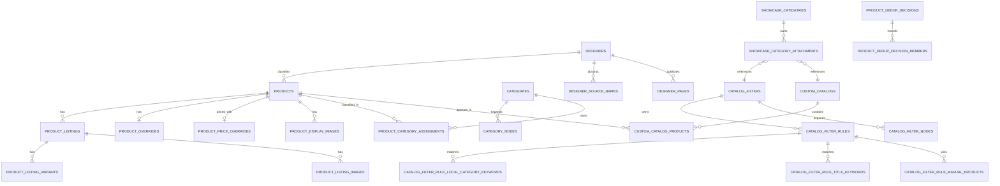

# 03. Logical Schema

> [!info]
> Ниже уже не просто концепция, а целевая логическая структура таблиц.
> Это write-model новой БД.

## 1. Catalog core

### `products`

Канонический товар каталога.

Это не source snapshot и не editorial override.
Эта таблица хранит базовую бизнес-сущность товара, вокруг которой уже живут listing, override, изображения и таксономия.

| Column | Type | Null | Meaning |
|---|---|---:|---|
| `id` | bigint | no | PK |
| `designer_id` | bigint | yes | Канонический дизайнер |
| `gender` | text enum | no | `male / female / unisex` |
| `commercial_availability_mode` | text enum | no | `in_stock / by_order` |
| `weight_grams` | integer | yes | Канонический вес |
| `weight_source_kind` | text enum | yes | `source / rule / manual` |
| `lifecycle_status` | text enum | no | `active / merged / deleted` |
| `visibility_status` | text enum | no | `visible / hidden` |
| `created_at` | timestamptz | no | Создан |
| `updated_at` | timestamptz | no | Обновлен |
| `deleted_at` | timestamptz | yes | Soft delete при необходимости |

### `product_listings`

Карточка товара конкретного источника.

| Column | Type | Null | Meaning |
|---|---|---:|---|
| `id` | bigint | no | PK |
| `product_id` | bigint | no | FK -> `products.id` |
| `source_id` | bigint | no | FK -> `sources.id` |
| `external_id` | text | yes | Внешний product id source |
| `url` | text | no | Нормализованный source URL |
| `handle` | text | yes | Source handle |
| `source_title` | text | no | Базовое название listing |
| `source_description_html` | text | yes | HTML-описание |
| `source_description_text` | text | yes | Plain-text описание |
| `source_designer_raw` | text | yes | Сырой бренд источника |
| `source_category_raw` | text | yes | Сырая category источника |
| `source_orderability_status` | text enum | no | `orderable / sold_out / unavailable` |
| `status_reason` | text | yes | Причина недоступности |
| `ingest_mode` | text enum | no | `sync / manual` |
| `technical_source_profile_id` | bigint | yes | Вспомогательный technical profile для manual/special ingest |
| `first_seen_at` | timestamptz | no | Первый импорт |
| `last_seen_at` | timestamptz | no | Последний импорт |
| `last_synced_at` | timestamptz | yes | Последний update listing |
| `is_enabled` | boolean | no | Listing участвует в каталоге |
| `created_at` | timestamptz | no | Создан |
| `updated_at` | timestamptz | no | Обновлен |

> [!important]
> В новой модели базовые title/description живут только в `product_listings`.
> `sync`-listing хранит тексты источника.
> `manual`-listing хранит тексты, введенные админом.
> Отдельного канонического дубля title/description в `products` больше нет.

> [!important]
> `source_orderability_status` не равен витринному `В наличии / Под заказ`.
> `source_orderability_status` отвечает только на вопрос, можно ли сейчас купить товар у исходного продавца.

### `product_listing_variants`

| Column | Type | Null | Meaning |
|---|---|---:|---|
| `id` | bigint | no | PK |
| `listing_id` | bigint | no | FK -> `product_listings.id` |
| `position` | integer | no | Стабильный порядок |
| `source_ref_id` | text | yes | Внешний id варианта |
| `sku` | text | yes | SKU варианта |
| `title` | text | no | Название варианта |
| `price_amount` | numeric | yes | Цена |
| `compare_at_price_amount` | numeric | yes | Исходная цена до скидки |
| `currency_code` | char(3) | yes | Валюта |
| `is_orderable` | boolean | no | Можно ли сейчас заказать вариант у источника |
| `created_at` | timestamptz | no | Создан |
| `updated_at` | timestamptz | no | Обновлен |

### `product_listing_images`

| Column | Type | Null | Meaning |
|---|---|---:|---|
| `id` | bigint | no | PK |
| `listing_id` | bigint | no | FK -> `product_listings.id` |
| `position` | integer | no | Порядок от source |
| `url` | text | no | Source image URL |
| `created_at` | timestamptz | no | Создан |

### `product_overrides`

Editorial-слой поверх `products`, который можно отдельно сбрасывать без переписывания базового канонического товара.

| Column | Type | Null | Meaning |
|---|---|---:|---|
| `product_id` | bigint | no | PK/FK -> `products.id` |
| `title_override` | text | yes | Ручное название |
| `description_override` | text | yes | Ручное описание |
| `description_visibility_override` | boolean | yes | Показывать ли описание |
| `force_visible` | boolean | no | Форс-переопределение auto-hide |
| `created_at` | timestamptz | no | Создан |
| `updated_at` | timestamptz | no | Обновлен |

> [!important]
> `title_override` и `description_override` не являются “второй копией канонических полей”.
> Это единственный ручной слой переопределения поверх базовых полей primary listing.

### `product_price_overrides`

Отдельная 1:1 сущность ручной рублевой цены товара.

| Column | Type | Null | Meaning |
|---|---|---:|---|
| `product_id` | bigint | no | PK/FK -> `products.id` |
| `manual_price_rub` | numeric | no | Ручная итоговая цена в рублях |
| `manual_compare_at_price_rub` | numeric | yes | Старая цена в рублях для эффекта скидки |
| `created_at` | timestamptz | no | Создан |
| `updated_at` | timestamptz | no | Обновлен |

> [!important]
> Наличие строки в `product_price_overrides` означает, что для товара отключен derived pricing из source + формулы.
> Синхронизация товара как сущности не выключается, выключается только автоматическое вычисление итоговой витринной цены.

> [!important]
> `manual_compare_at_price_rub` не является второй “текущей” ценой.
> Это только зачеркнутая старая рублевая цена для витринного эффекта скидки.

### `product_display_images`

| Column | Type | Null | Meaning |
|---|---|---:|---|
| `id` | bigint | no | PK |
| `product_id` | bigint | no | FK -> `products.id` |
| `listing_image_id` | bigint | yes | FK -> `product_listing_images.id` |
| `image_asset_id` | bigint | yes | FK -> `image_assets.id` |
| `position` | integer | no | Итоговый порядок |
| `is_hidden` | boolean | no | Скрыто ли изображение |
| `origin_kind` | text enum | no | `source_image / uploaded_asset` |
| `created_at` | timestamptz | no | Создан |
| `updated_at` | timestamptz | no | Обновлен |

> [!important]
> Если `listing_image_id` заполнен, он обязан ссылаться на изображение такого listing, который принадлежит тому же `product_id`.
> То есть display-галерея товара не может ссылаться на source-image чужого товара.

> [!warning]
> В старой схеме поля вида `*_asset_ids` по имени обещали хранить IDs, но фактически местами содержали URL-строки.
> В новой схеме это запрещено.
> Если колонка называется `*_id`, она хранит только FK-значение.

## 2. Designers

### `designers`

| Column | Type | Null | Meaning |
|---|---|---:|---|
| `id` | bigint | no | PK |
| `name` | text | no | Каноническое имя дизайнера |
| `slug` | text | no | URL-friendly slug |
| `is_enabled` | boolean | no | Дизайнер активен |
| `created_at` | timestamptz | no | Создан |
| `updated_at` | timestamptz | no | Обновлен |

### `designer_source_names`

| Column | Type | Null | Meaning |
|---|---|---:|---|
| `id` | bigint | no | PK |
| `designer_id` | bigint | yes | FK -> `designers.id` |
| `source_name` | text | no | Исходный бренд источника |
| `normalized_key` | text | no | Нормализованный ключ |
| `include_in_directory` | boolean | no | Участвует ли в директории |
| `created_at` | timestamptz | no | Создан |
| `updated_at` | timestamptz | no | Обновлен |

### `designer_pages`

| Column | Type | Null | Meaning |
|---|---|---:|---|
| `id` | bigint | no | PK |
| `designer_id` | bigint | no | FK -> `designers.id` |
| `title` | text | no | Название страницы |
| `description` | text | yes | Описание страницы |
| `is_enabled` | boolean | no | Витринная активность |
| `created_at` | timestamptz | no | Создан |
| `updated_at` | timestamptz | no | Обновлен |

## 3. Taxonomy and showcase

### `categories`

Локальные категории товара.

| Column | Type | Null | Meaning |
|---|---|---:|---|
| `id` | bigint | no | PK |
| `slug` | text | no | Системный slug |
| `name` | text | no | Внутреннее имя |
| `display_name` | text | no | Имя для UI |
| `is_enabled` | boolean | no | Активность |
| `created_at` | timestamptz | no | Создан |
| `updated_at` | timestamptz | no | Обновлен |

### `category_nodes`

Отдельная таблица дерева локальных категорий.

| Column | Type | Null | Meaning |
|---|---|---:|---|
| `id` | bigint | no | PK |
| `category_id` | bigint | no | FK -> `categories.id` |
| `parent_node_id` | bigint | yes | FK -> `category_nodes.id` |
| `position` | integer | no | Порядок внутри parent |

### `category_keyword_rules`

Ключевые слова автоклассификации локальных категорий.

| Column | Type | Null | Meaning |
|---|---|---:|---|
| `id` | bigint | no | PK |
| `category_id` | bigint | no | FK -> `categories.id` |
| `keyword_kind` | text enum | no | `local_category / title` |
| `keyword` | text | no | Ключевое слово |

### `product_category_assignments`

Связь товара с локальными категориями.

| Column | Type | Null | Meaning |
|---|---|---:|---|
| `product_id` | bigint | no | FK -> `products.id` |
| `category_id` | bigint | no | FK -> `categories.id` |
| `assignment_kind` | text enum | no | `rule / manual_starred` |
| `sort_order` | integer | yes | Порядок ручного приоритета |
| `created_at` | timestamptz | no | Создан |
| `updated_at` | timestamptz | no | Обновлен |

### `catalog_filters`

Это справочник фильтров как бизнес-сущностей.

| Column | Type | Null | Meaning |
|---|---|---:|---|
| `id` | bigint | no | PK |
| `slug` | text | no | Системный slug |
| `name` | text | no | Внутреннее имя |
| `display_name` | text | no | Имя в витрине |
| `node_kind` | text enum | no | `filter / multifilter` |
| `is_enabled` | boolean | no | Активность |
| `created_at` | timestamptz | no | Создан |
| `updated_at` | timestamptz | no | Обновлен |

### `catalog_filter_rules`

Отдельная сущность rule-layer.
Даже если у фильтра initially будет только один active rule-set, правило не должно растворяться в самой сущности фильтра.

| Column | Type | Null | Meaning |
|---|---|---:|---|
| `id` | bigint | no | PK |
| `filter_id` | bigint | no | FK -> `catalog_filters.id` |
| `rule_kind` | text enum | no | `inclusion` |
| `is_enabled` | boolean | no | Активность |
| `created_at` | timestamptz | no | Создан |
| `updated_at` | timestamptz | no | Обновлен |

### `catalog_filter_nodes`

Отдельная таблица дерева.

| Column | Type | Null | Meaning |
|---|---|---:|---|
| `id` | bigint | no | PK |
| `filter_id` | bigint | no | FK -> `catalog_filters.id` |
| `parent_node_id` | bigint | yes | FK -> `catalog_filter_nodes.id` |
| `position` | integer | no | Порядок внутри parent |

### `catalog_filter_rule_local_category_keywords`

| Column | Type | Null | Meaning |
|---|---|---:|---|
| `id` | bigint | no | PK |
| `rule_id` | bigint | no | FK -> `catalog_filter_rules.id` |
| `keyword` | text | no | Ключевое слово локальной категории |

### `catalog_filter_rule_title_keywords`

| Column | Type | Null | Meaning |
|---|---|---:|---|
| `id` | bigint | no | PK |
| `rule_id` | bigint | no | FK -> `catalog_filter_rules.id` |
| `keyword` | text | no | Ключевое слово title |

### `catalog_filter_rule_manual_products`

| Column | Type | Null | Meaning |
|---|---|---:|---|
| `rule_id` | bigint | no | FK -> `catalog_filter_rules.id` |
| `product_id` | bigint | no | FK -> `products.id` |

### `custom_catalogs`

| Column | Type | Null | Meaning |
|---|---|---:|---|
| `id` | bigint | no | PK |
| `slug` | text | no | Уникальный slug |
| `name` | text | no | Имя каталога |
| `is_enabled` | boolean | no | Виден ли каталог |
| `created_at` | timestamptz | no | Создан |
| `updated_at` | timestamptz | no | Обновлен |

### `custom_catalog_products`

| Column | Type | Null | Meaning |
|---|---|---:|---|
| `catalog_id` | bigint | no | FK -> `custom_catalogs.id` |
| `product_id` | bigint | no | FK -> `products.id` |
| `position` | integer | no | Порядок товара |
| `is_hidden` | boolean | no | Скрыт ли товар |

### `showcase_categories`

Фиксированные верхние сущности витрины.

| Column | Type | Null | Meaning |
|---|---|---:|---|
| `id` | bigint | no | PK |
| `code` | text | no | `new / designers / men / women / sale` |
| `label` | text | no | Видимое имя |
| `behavior_kind` | text enum | no | Тип поведения |
| `system_gender_value` | text | yes | Для `men/women` |

### `showcase_category_attachments`

| Column | Type | Null | Meaning |
|---|---|---:|---|
| `id` | bigint | no | PK |
| `showcase_category_id` | bigint | no | FK -> `showcase_categories.id` |
| `attachment_kind` | text enum | no | `filter / custom_catalog` |
| `filter_id` | bigint | yes | FK -> `catalog_filters.id` |
| `custom_catalog_id` | bigint | yes | FK -> `custom_catalogs.id` |
| `position` | integer | no | Порядок |

### `showcase_category_attachment_hidden_nodes`

| Column | Type | Null | Meaning |
|---|---|---:|---|
| `attachment_id` | bigint | no | FK -> `showcase_category_attachments.id` |
| `filter_node_id` | bigint | no | FK -> `catalog_filter_nodes.id` |

> [!important]
> `filter_node_id` обязан принадлежать тому же фильтру, который используется текущим `attachment_id`.
> Нельзя скрывать узел чужого фильтра через attachment другой сущности.

## 4. Dedup decisions

### `product_dedup_decisions`

Журнал решений админа по дублям и откатам.

| Column | Type | Null | Meaning |
|---|---|---:|---|
| `id` | bigint | no | PK |
| `decision_kind` | text enum | no | `reject / merge / combine / undo` |
| `created_product_id` | bigint | yes | FK -> `products.id`, если `combine` создал новый канонический товар |
| `reverted_decision_id` | bigint | yes | FK -> `product_dedup_decisions.id` |
| `notes` | text | yes | Комментарий админа |
| `created_by_admin_user_id` | bigint | yes | FK -> `admin_users.id` |
| `created_at` | timestamptz | no | Создан |

### `product_dedup_decision_members`

Состав участников решения.

| Column | Type | Null | Meaning |
|---|---|---:|---|
| `decision_id` | bigint | no | FK -> `product_dedup_decisions.id` |
| `product_id` | bigint | no | FK -> `products.id` |
| `member_role` | text enum | no | `survivor / duplicate / input / result` |

## 5. Logical schema diagram

