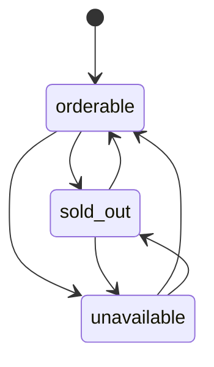
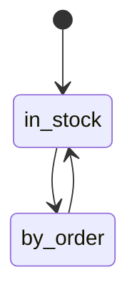
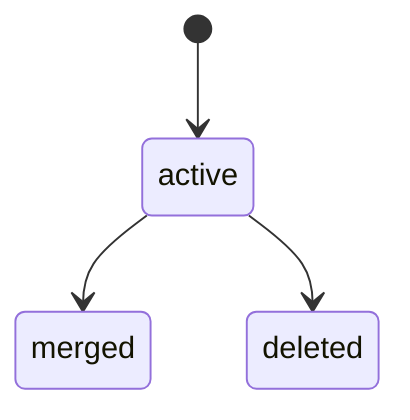
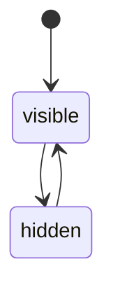
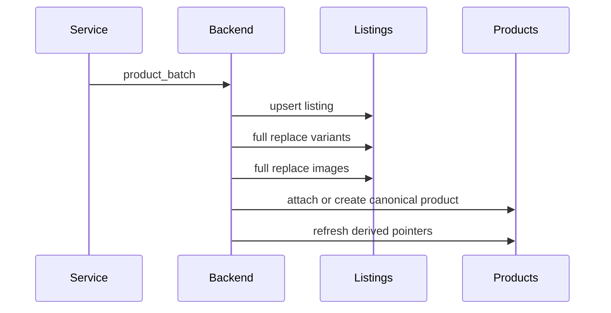
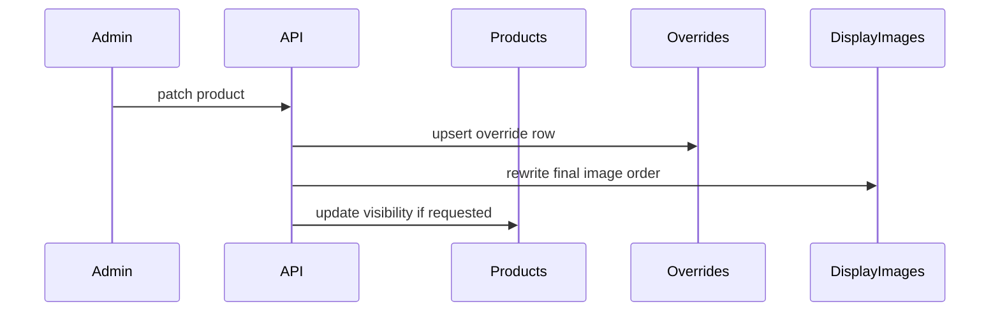

# 04. State, Lifecycle And Write Rules

## 1. Почему один `status` больше недопустим

В старой модели одно поле `status` пыталось одновременно выражать:

- наличие товара;
- скрыт ли он витринно;
- пропал ли он из source;
- отключен ли он дедупом;
- auto-hide политику source.

Это плохая модель.

Новая модель делит состояния по слоям.

## 2. Состояния `product_listings`

### `source_orderability_status`

- `orderable`
- `sold_out`
- `unavailable`

### `status_reason`

Nullable поле.

Используется только как объяснение текущего состояния listing.
Примеры:

- `missing_weight`
- `missing_currency`
- `missing_variants`
- `source_removed`
- `manually_disabled`

## 3. Состояния `products`

### `commercial_availability_mode`

- `in_stock`
- `by_order`

Это отдельная коммерческая ось товара.

`in_stock` означает:

- товар уже физически находится у продавца;
- на витрине он показывается как `В наличии`.

`by_order` означает:

- товар можно привезти из источника под заказ;
- на витрине он показывается как `Под заказ`.

### `lifecycle_status`

- `active`
- `merged`
- `deleted`

### `visibility_status`

- `visible`
- `hidden`

Это separate axis.

`hidden` не означает:

- что listing unavailable;
- что source disabled;
- что товар merged.

## 4. State diagram

## 5. Write rules by scenario

### 5.1. Sync из parser service

Пишет только в source-layer:

- `product_listings`
- `product_listing_variants`
- `product_listing_images`

И обновляет derived linkage к `products`.

Sync **не должен**:

- затирать admin override;
- затирать `product_price_overrides`;
- затирать display image order;
- создавать dedup-артефакты;
- напрямую править showcase taxonomy.

### 5.2. Manual product create

Создает:

- `products`
- один `product_listing` в режиме `manual`
- ручные variants
- ручные display images

> [!note]
> Если в runtime остается специальный `manual source`, он используется только как технический профиль режима `manual`, но не как бизнес-источник товара.

### 5.3. Manual product edit

Меняет:

- canonical product fields;
- `gender`;
- `commercial_availability_mode`;
- manual listing fields;
- `product_price_overrides` при ручной цене или ручной скидке;
- override fields при необходимости;
- display images;
- category links.

### 5.4. Bind manual product to source

Не должен менять сущность товара.

Он должен:

- либо перепривязать существующий `manual listing` к `source`;
- либо создать второй listing у того же product.

### 5.5. Dedup merge

Не создает новый товар.

Он должен:

- выбрать surviving `product`;
- перевести `product_listings` duplicate product под surviving product;
- duplicate product перевести в `lifecycle_status = merged`.

### 5.6. Dedup combine

Если combine реально нужен как отдельный бизнес-сценарий, он тоже не должен создавать `dedup://...`.

Правильнее:

- создать новый канонический `product`;
- оба старых перевести в `merged`;
- все `product_listings` перепривязать к новому продукту;
- решение зафиксировать в `product_dedup_decisions`.

## 6. Derived fields

Эти поля не должны быть write-source:

- итоговый title товара;
- итоговое description товара;
- итоговая цена товара;
- итоговая валюта товара;
- итоговая исходная цена товара до скидки;
- количество изображений товара;
- materialized список variants для UI;
- materialized список category labels.

Также derived, а не canonical:

- `display_title`
- `display_description`
- `display_commercial_badge`
- `primary_listing_id` для UI/storefront;
- `effective_source_id` для UI;
- `display_status`, если он собирается из visibility + auto-hide source + source orderability;
- `is_favorite`, если он выводится из category links.

Их место:

- либо view;
- либо projection table;
- либо runtime response assembler.

## 7. Projection rules for listing, variant and price

### 7.1. Primary listing

`primary_listing_id` не должен храниться в write-model `products`.
Это projection-level указатель.

Он выбирается детерминированно:

1. только среди `product_listings.is_enabled = true`;
2. сначала `source_orderability_status = orderable`, потом `sold_out`, потом `unavailable`;
3. при равенстве статуса приоритетнее listing с более свежим `last_synced_at`;
4. при полном равенстве выигрывает меньший `id`.

### 7.2. Primary variant

После выбора primary listing projection выбирает variant:

1. сначала среди `is_orderable = true`;
2. если таких нет, среди всех variants listing;
3. берется вариант с минимальным `price_amount`;
4. при равенстве выигрывает меньший `position`.

### 7.3. Display price

Каталожная цена читается по приоритету:

1. если существует строка в `product_price_overrides`, то:

- `display_price_rub <- product_price_overrides.manual_price_rub`
- `display_compare_at_price_rub <- product_price_overrides.manual_compare_at_price_rub`
- derived pricing pipeline не применяется

2. если строки в `product_price_overrides` нет, то pricing строится обычным derived-процессом из primary variant + pricing settings.

Для derived-режима:

- `display_price_amount <- primary_variant.price_amount`
- `display_currency_code <- primary_variant.currency_code`
- `display_compare_at_price_amount <- primary_variant.compare_at_price_amount`

### 7.4. Display title and description

Итоговые тексты для UI не должны храниться отдельно в write-model.

Они собираются так:

- `display_title <- product_overrides.title_override ?? primary_listing.source_title`
- `display_description <- product_overrides.description_override ?? primary_listing.source_description_text`

Если source-профиль разрешает HTML-описание, то projection дополнительно может отдать:

- `display_description_html <- primary_listing.source_description_html`

Но это именно render-выбор ответа, а не отдельное каноническое поле товара.

### 7.5. Display commercial badge

Витринный бейдж должен читаться только из `products.commercial_availability_mode`:

- `in_stock -> "В наличии"`
- `by_order -> "Под заказ"`

Он не должен вычисляться из `source_orderability_status`, потому что это разные смыслы.

### 7.6. Reset to derived pricing

Возврат товара обратно на автоматическое ценообразование должен происходить удалением строки из `product_price_overrides`.

Отдельный флаг вида `price_sync_locked` в `products` или `product_listings` для этого не нужен.

## 8. Sequence: sync

## 9. Sequence: admin override

