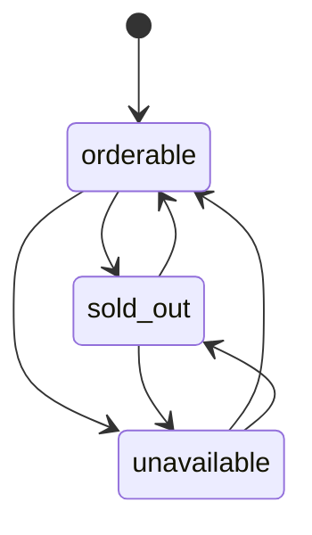
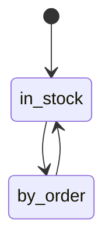
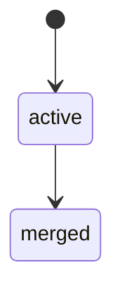
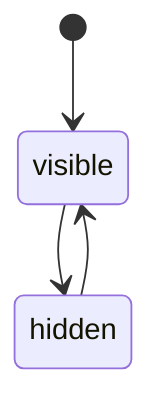
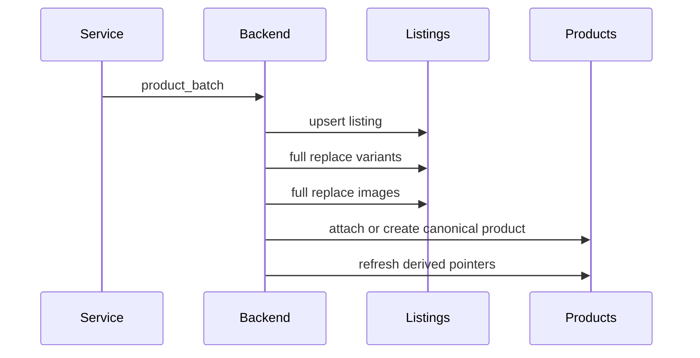

# 04. State, Lifecycle And Write Rules

## 1. Почему один `status` больше недопустим

В старой модели одно поле `status` пыталось одновременно выражать:

- наличие товара;
- скрыт ли он витринно;
- пропал ли он из source;
- отключен ли он дедупом;
- auto-hide политику source.

Это плохая модель.

Новая модель делит состояния по слоям.

## 2. Состояния `product_listings`

### `orderability_status`

- `orderable`
- `sold_out`
- `unavailable`

### `status_reason`

Nullable поле.

Используется только как объяснение текущего состояния listing.
Примеры:

- `missing_weight`
- `missing_currency`
- `missing_variants`
- `source_removed`
- `manually_disabled`

### Правило про отсутствие веса

Если у товара:

- `products.manual_weight_grams` не задан;
- `source_weight_grams` отсутствует или равен нулю;
- подходящее weight rule не найдено;

то итоговый вес считается отсутствующим, а listing должен переходить в:

- `orderability_status = unavailable`
- `status_reason = missing_weight`

Если позже админ задает ручной вес, это правило перестает применяться к этому товару,
пока ручной вес явно не снят.

## 3. Состояния `products`

### `availability_mode`

- `in_stock`
- `by_order`

Это отдельная коммерческая ось товара.

`in_stock` означает:

- товар уже физически находится у продавца;
- на витрине он показывается как `В наличии`.

`by_order` означает:

- товар можно привезти из источника под заказ;
- на витрине он показывается как `Под заказ`.

### `lifecycle_status`

- `active`
- `merged`

### `visibility_status`

- `visible`
- `hidden`

Это separate axis.

`hidden` не означает:

- что listing unavailable;
- что source disabled;
- что товар merged.

## 4. State diagram

## 5. Write rules by scenario

### 5.1. Sync из parser service

Пишет только в source-layer:

- `product_listings`
- `product_listing_variants`
- `product_listing_images`

И обновляет derived linkage к `products`.

Sync **не должен**:

- затирать `product_presentation`;
- затирать `product_price_overrides`;
- затирать display image order;
- создавать dedup-артефакты;
- напрямую править showcase taxonomy.

### 5.2. Manual product create

Создает:

- `products`
- один `product_listing` в режиме `manual`
- ручные variants
- ручные display images

> [!note]
> Если в runtime остается специальный `manual source`, он используется только как технический профиль режима `manual`, но не как бизнес-источник товара.

### 5.3. Manual product edit

Меняет:

- canonical product fields;
- `gender`;
- `availability_mode`;
- `primary_listing_id`;
- `manual_weight_grams` при ручном весе;
- manual listing fields;
- `product_price_overrides` при ручной цене или ручной скидке;
- `product_presentation` при необходимости;
- display images;
- category links.

Правило для изображений:

- source image у синхронизированного товара не удаляется, а только скрывается;
- uploaded image можно удалить из фото-стека конкретного listing полностью;
- итоговый порядок картинок управляется только через `product_listing_gallery_images`.

### 5.4. Bind manual product to source

Не должен менять сущность товара.

Он должен:

- создать source-listing как отдельную атомарную сущность;
- включить его в состав товара через `product_listing_members`;
- при необходимости выбрать его новым `primary_listing_id`.

### 5.5. Dedup merge

Создает новый витринный товар.

Он должен:

- создать новый `product`;
- собрать в нем плоский union member-listing входных товаров;
- перепривязать эти member-listing к новому `product`, чтобы у каждого listing остался один текущий владелец;
- выбрать один из member-listing как `primary_listing_id`;
- старые входные `product` перевести в `lifecycle_status = merged`;
- решение зафиксировать в `product_dedup_decisions`.

### 5.6. Change filter node kind

При смене `filters.node_kind` запись нельзя сохранять вслепую.

Система должна сначала провалидировать дерево:

- узел `filter` не может иметь детей;
- parent/child-связи после смены типа должны оставаться допустимыми;
- существующие showcase attachment и hidden-node ссылки не должны терять смысл.

### 5.7. Showcase category lifecycle

`showcase_categories` не создаются и не удаляются из admin UI.

Правильный путь:

- фиксированный набор записей создается seed/migration-слоем;
- админ меняет только attachments и hidden-node состояние внутри этих категорий;
- ограничения по `new / designers / men / women / sale` валидируются backend-логикой по `code`.

## 6. Derived fields

Эти поля не должны быть write-source:

- итоговый title товара;
- итоговое description товара;
- итоговая цена товара;
- итоговая валюта товара;
- итоговая исходная цена товара до скидки;
- количество изображений товара;
- materialized список variants для UI;
- materialized список category labels.

Также derived, а не canonical:

- `display_title`
- `display_description`
- `display_commercial_badge`
- `effective_source_id` для UI;
- `display_status`, если он собирается из visibility + auto-hide source + source orderability;
- `is_favorite`, если он выводится из category links.

Их место:

- либо view;
- либо projection table;
- либо runtime response assembler.

## 7. Projection rules for listing, variant and price

### 7.1. Primary listing

`primary_listing_id` должен храниться в write-model `products`.
Это явный выбор того member-listing, который дает товару базовые title/description по умолчанию.

Ограничения:

1. он должен ссылаться только на listing, входящий в `product_listing_members` этого товара;
2. при merge админ или backend должен явно выбрать новый `primary_listing_id`;
3. если текущий primary listing пропал у источника, система должна детерминированно выбрать новый active member-listing.

### 7.2. Primary variant

После выбора primary listing projection выбирает variant:

1. сначала среди `is_orderable = true`;
2. если таких нет, среди всех variants listing;
3. берется вариант с минимальным `price_amount`;
4. при равенстве выигрывает меньший `position`.

После выбора variant UI получает:

- `effective_source_id <- selected_variant.listing.source_id`
- `effective_listing_id <- selected_variant.listing_id`
- фото-стек только из `product_listing_gallery_images` для этого `product_id + listing_id`

### 7.3. Display price

Каталожная цена читается по приоритету:

1. если существует строка в `product_price_overrides`, то:

- `display_price_rub <- product_price_overrides.manual_price_rub`
- `display_compare_at_price_rub <- product_price_overrides.manual_compare_at_price_rub`
- derived pricing pipeline не применяется

2. если строки в `product_price_overrides` нет, то pricing строится обычным derived-процессом из primary variant + pricing settings.

Для derived-режима:

- `display_price_amount <- primary_variant.price_amount`
- `display_currency_code <- primary_variant.currency_code`
- `display_compare_at_price_amount <- primary_variant.compare_at_price_amount`

### 7.4. Effective weight

Итоговый вес товара должен читаться по приоритету:

1. если `products.manual_weight_grams IS NOT NULL`, то итоговый вес берется из него;
2. если у primary listing есть `source_weight_grams > 0`, то итоговый вес берется из source;
3. если source-веса у primary listing нет, система ищет weight rule, сохраняет его в `products.weight_rule_id` и берет вес из этого правила;
4. если ни один источник веса не найден, итоговый вес считается отсутствующим.

При этом отсутствие итогового веса не является просто нейтральным отсутствием данных.
Для source-listing это означает, что товар нельзя нормально продавать, поэтому он должен
получить `orderability_status = unavailable` и `status_reason = missing_weight`.

При изменении `weight_rule_keywords` или `weight_rules` нельзя синхронно пересчитывать весь каталог.
Нужен фоновый batch-пересчет только затронутых товаров.

Если у нескольких правил одинаковое число совпадений, нужен только детерминированный технический tie-break.
Ручной приоритет через поле вроде `sort_order` для этого не нужен.

Дополнительные write-правила:

1. если админ задает `manual_weight_grams`, sync и rules больше не могут менять итоговый вес этого товара;
2. если у primary listing позже появляется нормальный source-вес, а ручного веса нет, `products.weight_rule_id` должен очищаться;
3. если source-веса нет и rule тоже больше не срабатывает, `products.weight_rule_id` должен очищаться;
4. `products.weight_rule_id` не хранит историю, а только текущее активное rule-сопоставление.

### 7.5. Display title and description

Итоговые тексты для UI не должны храниться отдельно в write-model.

Они собираются так:

- `display_title <- product_presentation.title_override ?? primary_listing.source_title`
- `effective_description_text <- product_presentation.description_text ?? primary_listing.source_description_text`
- `effective_description_html <- product_presentation.description_html ?? primary_listing.source_description_html`

Открытое API не должно возвращать два параллельных описания товара.
Оно должно возвращать одно поле `description`.

Правило выбора:

Сначала берутся настройки источника именно у `primary_listing.source_id`.

1. если `source_settings.description_mode = hidden`, описание не отдается;
2. если `source_settings.description_mode = text`, `description <- effective_description_text`;
3. если `source_settings.description_mode = html`, `description <- effective_description_html ?? effective_description_text`.

Это именно render-выбор ответа, а не отдельное каноническое поле товара.

Если у товара несколько member-listing, базовые title/description всегда берутся именно из `products.primary_listing_id`,
а не пытаются автоматически склеиваться из нескольких источников.

Если один из member-listing исчез у источника, это не должно ломать весь merged product и не требует переписывать историю merge.
Активный витринный товар просто продолжает работать на оставшемся наборе доступных member-listing.
Если исчезнувший listing был primary, система должна выбрать новый `primary_listing_id`.

### 7.6. Display commercial badge

Витринный бейдж должен читаться только из `products.availability_mode`:

- `in_stock -> "В наличии"`
- `by_order -> "Под заказ"`

Он не должен вычисляться из `orderability_status`, потому что это разные смыслы.

### 7.7. Reset to derived pricing

Возврат товара обратно на автоматическое ценообразование должен происходить удалением строки из `product_price_overrides`.

Отдельный флаг вида `price_sync_locked` в `products` или `product_listings` для этого не нужен.

## 8. Sequence: sync

## 9. Sequence: admin presentation edit

