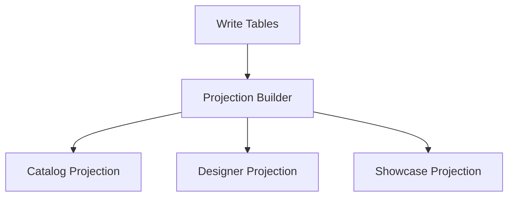

# 05. SQL Constraints And Indexing

## 1. Общие принципы

Новая БД должна опираться на:

- минимально достаточную нормализацию;
- строгие FK;
- уникальности, выражающие доменную правду;
- projection отдельно от write-model.

## 2. Обязательные уникальности

### `sources`

- `UNIQUE (key)`
- `UNIQUE (base_url_normalized)`

### `product_listings`

- `UNIQUE (source_id, url)`
- `UNIQUE (source_id, external_id)` where `external_id IS NOT NULL`
- `UNIQUE (source_id, handle)` only if source реально гарантирует стабильный handle

### `product_listing_variants`

- `UNIQUE (listing_id, position)`
- `UNIQUE (listing_id, source_ref_id)` where `source_ref_id IS NOT NULL`

### `product_price_overrides`

- `UNIQUE (product_id)`

### `designers`

- `UNIQUE (slug)`
- `UNIQUE (lower(name))`

### `designer_source_names`

- `UNIQUE (normalized_key)`

### `custom_catalogs`

- `UNIQUE (slug)`

### `showcase_categories`

- `UNIQUE (code)`

### `product_dedup_decision_members`

- `UNIQUE (decision_id, product_id, member_role)`

## 3. FK policy

### `CASCADE`

Нужен там, где child не имеет смысла без parent:

- `product_listings.product_id -> products.id`
- `product_listing_variants.listing_id -> product_listings.id`
- `product_listing_images.listing_id -> product_listings.id`
- `product_display_images.product_id -> products.id`
- `product_overrides.product_id -> products.id`

### `RESTRICT`

Нужен там, где удаление parent может уничтожить историю или административный смысл:

- `product_listings.source_id -> sources.id`
- `products.designer_id -> designers.id`

## 4.1. XOR and structural checks

Новая схема должна использовать явные `CHECK`, а не договоренности в коде.

### `product_display_images`

Ровно один источник происхождения:

- если `origin_kind = 'source_image'`, то `listing_image_id IS NOT NULL` и `image_asset_id IS NULL`
- если `origin_kind = 'uploaded_asset'`, то `listing_image_id IS NULL` и `image_asset_id IS NOT NULL`

И дополнительный relational invariant:

- `listing_image_id` должен ссылаться только на изображение listing того же `product_id`

### `showcase_category_attachments`

Ровно одна ссылка attachment:

- если `attachment_kind = 'filter'`, то `filter_id IS NOT NULL` и `custom_catalog_id IS NULL`
- если `attachment_kind = 'custom_catalog'`, то `filter_id IS NULL` и `custom_catalog_id IS NOT NULL`

### `showcase_category_attachment_hidden_nodes`

Дополнительный relational invariant:

- `filter_node_id` должен принадлежать тому же фильтру, который использует `attachment_id`

### `product_dedup_decisions`

- `created_product_id IS NOT NULL` только для `decision_kind = 'combine'`
- `reverted_decision_id IS NOT NULL` только для `decision_kind = 'undo'`

### `product_price_overrides`

- `manual_price_rub > 0`
- `manual_compare_at_price_rub IS NULL OR manual_compare_at_price_rub > manual_price_rub`

## 5. Индексы по реальным сценариям admin

### Список товаров

Нужны:

- `products (updated_at desc, id desc)`
- `products (visibility_status, lifecycle_status)`
- `products (commercial_availability_mode)`
- `products (designer_id)`
- `product_price_overrides (product_id)`
- `product_listings (product_id, is_enabled, last_synced_at desc)`

### URL / host lookup для admin

Нужны materialized lookup-поля:

- `product_listings.url_normalized`
- `product_listings.host_normalized`
- `sources.host_normalized`

И индексы:

- `product_listings (url_normalized)`
- `product_listings (host_normalized, handle)`
- `sources (host_normalized)`

### Поиск товара по source URL

- `product_listings (source_id, url)`
- `product_listings (url)` only if реально нужен global lookup

### Поиск и текстовые фильтры по товару

- текстовый поиск должен идти по `product_listings.source_title`
- текстовый поиск по описанию должен идти по `product_listings.source_description_text`
- если нужен быстрый каталоговый read, эти поля должны попадать в projection, а не дублироваться обратно в `products`

### Поиск товара по external_id

- `product_listings (source_id, external_id)`

### Директория дизайнеров

- `designer_source_names (normalized_key)`
- `designer_pages (designer_id)`

### Категоризация и фильтры

- `category_nodes (parent_node_id, position)`
- `product_category_assignments (category_id, product_id)`
- `catalog_filter_rules (filter_id, is_enabled)`
- `catalog_filter_nodes (parent_node_id, position)`
- `catalog_filter_rule_manual_products (rule_id, product_id)`
- `custom_catalog_products (catalog_id, position)`
- `showcase_category_attachments (showcase_category_id, position)`

## 6. Что не должно индексироваться “на всякий случай”

- большие JSON/text поля без отдельного сценария;
- nullable status reasons;
- duplicated display blobs;
- surrogate debug fields.

## 7. SQL-проблемы старого контура, которые нельзя переносить

### 6.1. Глобальный `UNIQUE (url)` на товаре

Это слишком грубо.

Почему плохо:

- один catalog product может иметь несколько source listing;
- ручной товар и source товар начинают конфликтовать по не тому уровню модели;
- URL принадлежит listing, а не product.

> [!note]
> Текущая живая БД как раз держится на `UNIQUE (parser_product.url)`, что и привело к слишком раннему смешению catalog product и source listing.

### 6.2. Варианты как JSON на товаре

Это ломает:

- нормальные индексы;
- частичные обновления;
- SQL-аналитику;
- integrity constraints.

При этом текущий runtime уже фактически использует отдельную lineage-таблицу и лишь потом рематериализует `variants` обратно в JSON.
Это дополнительный сигнал, что JSON надо убрать из write-model полностью.

### 6.3. Source lineage как единственный путь понять effective source

Если UI для товара вынужден вычислять “primary source” через origin-rows, значит ownership модели уже сломан.

### 6.5. Смешение source orderability и витринного наличия

Нельзя одним полем выражать сразу:

- можно ли выкупить товар у source;
- есть ли товар физически у продавца на руках;
- показывать ли бейдж `В наличии` или `Под заказ`.

### 6.6. Смешение source price и manual rub price

Нельзя одним и тем же набором полей выражать сразу:

- source price variant-а;
- source compare-at price;
- derived rub price после формулы;
- ручную рублевую цену;
- ручную зачеркнутую рублевую цену для скидки.

### 6.4. Full-scan fallback для поиска по URL

Это недопустимо для новой схемы.

Если admin-сценарий требует:

- preview by URL;
- probe by URL;
- source matching by host;

то схема обязана иметь:

- нормализованные URL/host lookup keys;
- SQL-индексы под эти lookup;
- отсутствие Python full-scan по всем товарам или всем source.

## 8. Projection strategy

Для fast-read можно держать отдельные projection tables или materialized views:

- `product_catalog_projection`
- `designer_directory_projection`
- `showcase_navigation_projection`

Но это именно read-layer, не write-layer.

## 9. Recommended view split

