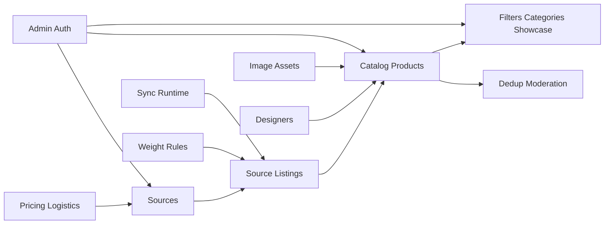

# 06. Supporting Contexts

## 1. Sources

### `sources`

Это не просто список магазинов.
Это паспорт источника.

| Column | Meaning |
|---|---|
| `key` | стабильный межсервисный идентификатор, который система один раз генерирует из `base_url` |
| `name` | название источника |
| `base_url` | базовый URL источника |

> [!important]
> `sources.key` не вводится вручную.
> Он автоматически строится из host части `base_url` при создании источника и после этого остается неизменным.

### `source_settings`

Это отдельный слой админских настроек источника.

| Column | Meaning |
|---|---|
| `source_id` | к какому источнику относятся настройки |
| `supplier_id` | логистический supplier |
| `is_enabled` | источник включен |
| `is_sync_enabled` | участвует ли в sync |
| `hide_auto_added_products` | auto-hide политика |
| `description_mode` | режим описания: `hidden / text / html` |
| `show_images` | показывать ли source images |
| `promo_factor` | pricing modifier |
| `promo_only_no_discount` | promo rule |
| `buyout_surcharge_value` | доп. наценка |
| `buyout_surcharge_currency` | валюта наценки |

### `source_sync_state`

Это runtime-состояние последней синхронизации по источнику.

| Column | Meaning |
|---|---|
| `source_id` | к какому источнику относится runtime-состояние |
| `last_sync_at` | последний sync |
| `last_sync_duration_sec` | длительность |
| `last_sync_status` | статус последнего sync |
| `last_error_code` | машинный код последней ошибки |
| `last_error_message` | текст последней ошибки |

> [!important]
> `source_sync_state` нужен как быстрый snapshot текущего состояния источника.
> Здесь хранится только последняя ошибка, а не вся история.

> [!note]
> Текущее состояние runtime показывает, что source-профиль реально живой и нужен, но продуктовая фильтрация по источнику не должна опираться только на `products.source_id`.
> Правильная основа для нее — связка `product_listing_members -> product_listings.source_id`.

> [!note]
> Source также не должен быть владельцем витринного состояния `В наличии / Под заказ`.
> Он владеет только source-level фактом, можно ли сейчас выкупить товар у исходного продавца.

> [!note]
> `source_settings.description_mode` у источника primary listing управляет только тем, в каком виде публичный API отдает описание товара.
> Сам текст и сам HTML хранятся на товарном слое отдельно.

> [!note]
> История ошибок должна жить не в `source_sync_state`, а в `sync_job_source_runs`.
> `source_sync_state` отвечает на вопрос "что сейчас с этим источником", а `sync_job_source_runs` отвечает на вопрос "что происходило по нему в каждом запуске".

## 2. Pricing and logistics

### `suppliers`

Справочник логистических направлений.

### `supplier_shipping_rates`

Тарифы по диапазонам веса.

### `pricing_settings`

Singleton или почти singleton контур формулы.

### `product_price_overrides`

Отдельный product-level слой ручной рублевой цены.

Его роль:

- выключить для товара derived pricing pipeline;
- хранить ручную итоговую цену в рублях;
- хранить ручную старую рублевую цену для эффекта скидки.

> [!important]
> `product_price_overrides` не должен жить в source-layer и не должен перезаписывать source prices variant-ов.

> [!warning]
> Если в `pricing_settings` остаются range-based rules, их лучше выносить в child tables, а не хранить JSON.

Кандидаты на child-таблицы:

- `pricing_service_fee_rules`
- `pricing_insurance_rules`
- `pricing_bucket_rates`

## 3. Weight rules

### `weight_rules`

- `weight_grams`
- `is_enabled`

### `weight_rule_keywords`

- `rule_id`
- `keyword`

> [!note]
> На большом каталоге нельзя делать полный синхронный пересчет веса после каждого добавления или удаления ключевого слова.
> Правильная модель:
> - отдельного `products.weight_grams` в write-model нет;
> - `product_listings.source_weight_grams` хранит source-вес, если источник его прислал;
> - `products.manual_weight_grams` хранит ручной вес, если админ его задал;
> - `products.weight_rule_id` хранит правило, которое сейчас дало итоговый вес, только если source-веса нет;
> - итоговый вес собирается при чтении по приоритету `manual -> source -> rule`;
> - правка rules запускает фоновый пересчет затронутых товаров или batch-пересчет.

> [!note]
> Ручной `sort_order` для правил веса не нужен.
> Нормальная логика выбора: выигрывает правило с наибольшим числом совпавших ключевых слов.

## 4. Showcase structure

Кроме filters/showcase нужны отдельные медийные сущности главной страницы.

### `showcase_settings`

Одна строка с hero-изображением первого экрана главной страницы.
Там нет текста, заголовка, CTA или layout-параметров, только ссылка на картинку.

### `showcase_carousel_images`

Отдельный список фотографий карусели главной страницы.
Здесь нужен только `image_asset_id` и `position`, потому что контент карусели состоит только из самих фото и их порядка.

## 4.1. Что не должно попадать в taxonomy rules

Новая таксономия не должна использовать как keyword-scope:

- `status`
- `visibility`
- любые оперативные derived flags availability слоя

Причина:

- это делает category assignment нестабильным;
- это смешивает мерчендайзинг и runtime-состояние товара;
- это ломает чистую Чен-модель, где категория зависит от сущности товара, а не от временного процесса sync.

## 4.2. Local category labels

Во фронте нет отдельного CRUD-контура для локальных категорий товара.

Поэтому в текущей модели:

- filter rules используют local-category labels как уже готовые classifier/source labels;
- эти labels не образуют отдельное дерево, которое админ редактирует в taxonomy-tab;
- showcase taxonomy читает их только как один из сигналов для filter matching.

## 5. Auth and admin

### `admin_users`
### `admin_roles`
### `admin_role_permissions`
### `admin_sessions` или token-layer вне БД по выбранной auth-модели

`admin_ui_settings` стоит оставить только для действительно UI-специфичных вещей:

- page size;
- default min designers count;
- мелкие admin UI preferences.

Но не для бизнес-данных витрины.

## 6. Dedup and moderation

Новый dedup-контур не должен создавать synthetic products вроде `dedup://...`.
Но он может и должен создавать новый обычный витринный `product` как результат merge.

Его write-model:

- `product_dedup_decisions`
- `product_dedup_decision_members`

При этом member-listing входных товаров не дублируются по нескольким витринным товарам.
После merge они перепривязываются к новому активному `product`.

А candidates лучше держать не как постоянную write-table, а как вычисляемый moderation queue или projection.

## 7. Sync runtime

Нужны:

- `sync_jobs`
- `sync_job_source_runs`
- `sync_applied_batches`

Не нужны в новом контуре:

- старые пустые parser-job таблицы, если они реально не используются runtime.

## 8. Media

### `image_assets`

Нужен единый справочник загруженных файлов.

Его роль:

- ручные изображения товаров;
- ручные изображения listing-стеков у товаров;
- hero/carousel;
- любые иные загруженные картинки админки.

> [!warning]
> В старой системе `image_asset` уже успел стать смешанным хранилищем:
> - часть строк реально обслуживает product/showcase uploads;
> - большая часть — legacy proxy-слой.
>
> В новой схеме нужно жестко разделить:
> - живые uploaded assets;
> - любые временные proxy/imported records, если они вообще останутся.

## 9. Full bounded-context map

