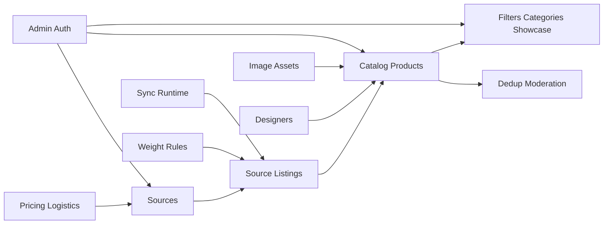

# 06. Supporting Contexts

## 1. Sources

### `sources`

Это не просто список магазинов.
Это административный профиль источника.

| Column | Meaning |
|---|---|
| `key` | стабильный межсервисный идентификатор |
| `name` | название источника |
| `base_url` | базовый URL источника |
| `is_enabled` | источник включен |
| `is_sync_enabled` | участвует ли в sync |
| `hide_auto_added_products` | auto-hide политика |
| `show_description` | показывать ли source description |
| `show_raw_description_html` | можно ли рендерить сырой HTML-блок source description |
| `show_images` | показывать ли source images |
| `supplier_id` | логистический supplier |
| `promo_factor` | pricing modifier |
| `promo_only_no_discount` | promo rule |
| `buyout_surcharge_value` | доп. наценка |
| `buyout_surcharge_currency` | валюта наценки |
| `last_sync_at` | последний sync |
| `last_sync_duration_sec` | длительность |
| `last_sync_status` | статус последнего sync |

> [!note]
> Текущее состояние runtime показывает, что source-профиль реально живой и нужен, но продуктовая фильтрация по источнику не должна опираться только на `products.source_id`.
> Правильная основа для нее — `product_listings.source_id`.

> [!note]
> Source также не должен быть владельцем витринного состояния `В наличии / Под заказ`.
> Он владеет только source-level фактом, можно ли сейчас выкупить товар у исходного продавца.

## 2. Pricing and logistics

### `suppliers`

Справочник логистических направлений.

### `supplier_shipping_rates`

Тарифы по диапазонам веса.

### `pricing_settings`

Singleton или почти singleton контур формулы.

### `product_price_overrides`

Отдельный product-level слой ручной рублевой цены.

Его роль:

- выключить для товара derived pricing pipeline;
- хранить ручную итоговую цену в рублях;
- хранить ручную старую рублевую цену для эффекта скидки.

> [!important]
> `product_price_overrides` не должен жить в source-layer и не должен перезаписывать source prices variant-ов.

> [!warning]
> Если в `pricing_settings` остаются range-based rules, их лучше выносить в child tables, а не хранить JSON.

Кандидаты на child-таблицы:

- `pricing_service_fee_rules`
- `pricing_insurance_rules`
- `pricing_bucket_rates`

## 3. Weight rules

### `weight_rules`

- `weight_grams`
- `sort_order`
- `is_enabled`

### `weight_rule_keywords`

- `rule_id`
- `keyword`

## 4. Showcase structure

Кроме filters/categories нужны:

### `showcase_sections`

Если верхняя навигация когда-либо перестанет быть жестко фиксированной.

Но прямо сейчас, исходя из admin как продукта, можно обойтись без отдельной runtime-table и держать:

- `showcase_categories` с фиксированным `code`.

### `showcase_media_settings`

Для hero/carousel медиа.
Если настройка одна на весь storefront, можно хранить это:

- либо в `admin_ui_settings`,
- либо в отдельной таблице `showcase_settings`.

Я бы предпочел:

- `showcase_settings`
- `showcase_carousel_items`

потому что это уже не auth и не технический UI-state.

## 4.1. Что не должно попадать в taxonomy rules

Новая таксономия не должна использовать как keyword-scope:

- `status`
- `visibility`
- любые оперативные derived flags availability слоя

Причина:

- это делает category assignment нестабильным;
- это смешивает мерчендайзинг и runtime-состояние товара;
- это ломает чистую Чен-модель, где категория зависит от сущности товара, а не от временного процесса sync.

## 4.2. Local categories as separate context

Локальные категории не должны растворяться внутри фильтров.

Это отдельный слой, потому что они нужны сразу для трех разных задач:

- админ видит их в карточке товара;
- rule-based логика использует их как один из сигналов;
- ручное “избранное” и ручная приоритизация живут именно на уровне категории товара, а не на уровне витринного фильтра.

Минимальный контур:

- `categories`
- `category_nodes`
- `category_keyword_rules`
- `product_category_assignments`

Именно из этого слоя уже могут читать:

- фильтр-правила;
- кастомные каталоги;
- витринные attachment-правила.

## 5. Auth and admin

### `admin_users`
### `admin_roles`
### `admin_role_permissions`
### `admin_sessions` или token-layer вне БД по выбранной auth-модели

`admin_ui_settings` стоит оставить только для действительно UI-специфичных вещей:

- page size;
- default min designers count;
- мелкие admin UI preferences.

Но не для бизнес-данных витрины.

## 6. Dedup and moderation

Новый dedup-контур не должен создавать synthetic products.

Его write-model:

- `product_dedup_decisions`
- `product_dedup_decision_members`

А candidates лучше держать не как постоянную write-table, а как вычисляемый moderation queue или projection.

## 7. Sync runtime

Нужны:

- `sync_jobs`
- `sync_job_source_runs`
- `sync_applied_batches`

Не нужны в новом контуре:

- старые пустые parser-job таблицы, если они реально не используются runtime.

## 8. Media

### `image_assets`

Нужен единый справочник загруженных файлов.

Его роль:

- ручные изображения товаров;
- hero/carousel;
- любые иные загруженные картинки админки.

> [!warning]
> В старой системе `image_asset` уже успел стать смешанным хранилищем:
> - часть строк реально обслуживает product/showcase uploads;
> - большая часть — legacy proxy-слой.
>
> В новой схеме нужно жестко разделить:
> - живые uploaded assets;
> - любые временные proxy/imported records, если они вообще останутся.

## 9. Full bounded-context map

